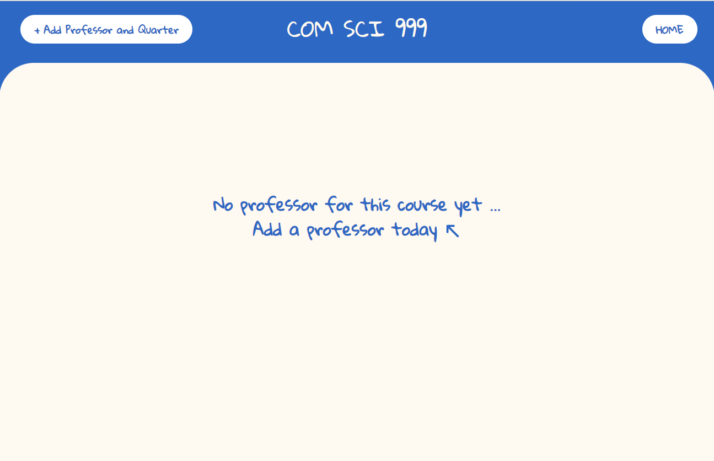

# Course Page Unit Test 

## Test 1 - Courses that does not have instructors or terms

**Objective**: to check whether the page can properly handle the edge case of an empty list. It occurs in a newly created course. 

**Input**: 
```[]```

**Outcome**: 


<br>

## Test 2 - Course that has an instructor, but no quarter associated to them 

**Objective**: to check whether the page can properly display the edge case of an empty sublist in the `terms` field of our data. The corresponding `div` should only show the professor.  

**Input**: 
```json
[{
    "instructor": "Kim, Miryung",
    "terms": ["Fall 2022", "Fall 2021"],
    "colorCode": 1,
  }, {
    "instructor": "DJ, JAYS",
    "terms": ["Spring 2022", "Fall 2022"],
    "colorCode": 2,
  }, {
    "instructor": "John Doe", 
    "terms": [],
    "colorCode": 3,
}]
```

**Outcome**: 

<figcaption align="center">The professor John Doe has no quarter associated to it </figcaption>

<br>

## Test 3 - User adds a professor and a term 

**Objective**: To check the functionality of the "Add Professor and Quarter" button and the popup input form. 

**Input**:
```
Click the "Add Professor and Quarter" button
Enter "Jane Doe" as professor, "Fall" as quarter, and "2022" as year
Hit the Submit button
```

**Outcome in the course page**:

<figcaption align="center" markdown="1">The professor Jane Doe with term Fall 2022 is displayed. It's background color is different from the one below. The link "Fall 2022" turns yellow after clicking it. It directs to the address `/COM SCI 123/Jane Doe/Fall 2022`</figcaption>

<br>

## Test 4 - Routing to the course note page

**Input**: 
```
Click the link "Fall 2022" under Jane Doe immediately after Jane Doe is created 
```

**Expected outcome**: 

<figcaption align="center">The user is routed to the course note page </figcaption>

<br>

## Test 5 - Invalid input 
**objective**: to check if the input form correctly validates user inputs 

**Input**: 
```
Click the "Add Professor and Quarter" button in the course page 
Does not enter the professor, enter "123" as quarter, and "202.2" as year
Hit the Submit button 
```

**Outcome**: 
```
The input form persists and keeps the current user inputs
The professor input field indicates the field is required 
The quarter input field indicates an invalid input (should be Fall/Winter/Spring/Summer)
The year input field indicates an invalid input (should be YYYY)
```

More automatic tests can be found in `course.test.js`
